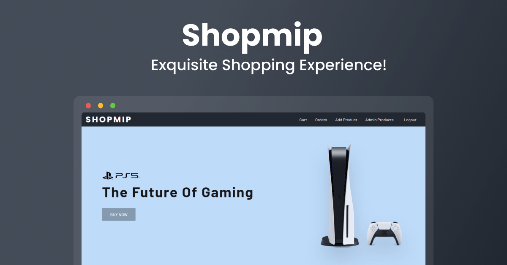

<a href="https://shopmip.onrender.com/">
    
  </a>

  <h2 align="center">Shopmip | Exquisite Shopping Experience</h2>

  <p align="center">A complete ecommerce solution for all of your shopping needs!</p>

  <p align="center">
    <a href="https://shopmip.onrender.com/">View Demo</a>
    ·
    <a href="https://github.com/SamipPoudel58/shopmip/issues">Report Bug</a>
    ·
    <a href="https://github.com/SamipPoudel58/shopmip/issues">Request Feature</a>
  </p>

## 🌟 Features

- Create, update and edit products
- Secure user registration and authentication
- Secure Payments with Stripe
- Fast image upload & optimization with Cloudinary
- Email Services using Sendgrid
- Generate bills in PDF form for every order

## ⚙️ Tech Stack

- Node.js
- Express.js
- EJS
- MongoDB

## 🚀 Local Development

Run the project in your machine locally.

### Step 1: Clone the repository

Clone the repo locally using:

```sh
git clone https://github.com/SamipPoudel58/shopmip.git
```

### Step 2: Install Dependencies

Install dependencies in the root folder

```sh
cd shopmip
npm install
```

### Step 3: Setup Environment Variables

You will need to provide your own `.env` variables, here's how you can do it:

- create a new file `.env` in the root
- open [.env.EXAMPLE](./.env.EXAMPLE)
- copy the contents and paste it into your own `.env` file
- make sure you replace the values with your own valid values

> Note: The `NODE_ENV` should either be "development" or "production". This will decide which database to use `MONGO_LOCAL` or `MONGO_ATLAS`

### Step 4: Run the server

```sh
npm run dev
```

## 🙏 Contributing

I'd love if you'd contribute to the project.

After cloning & setting up the local project you can push the changes to your github fork and make a pull request.

### Pushing the changes

```bash
git add .
git commit -m "feat: added new stuff"
git push YOUR_REPO_URL BRANCH_NAME
```
